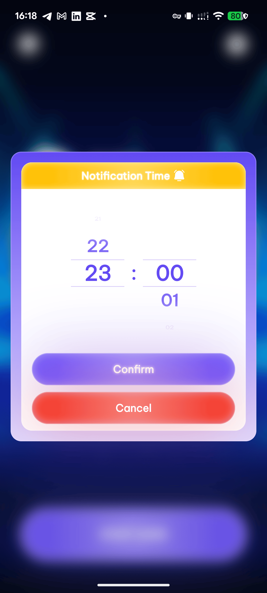
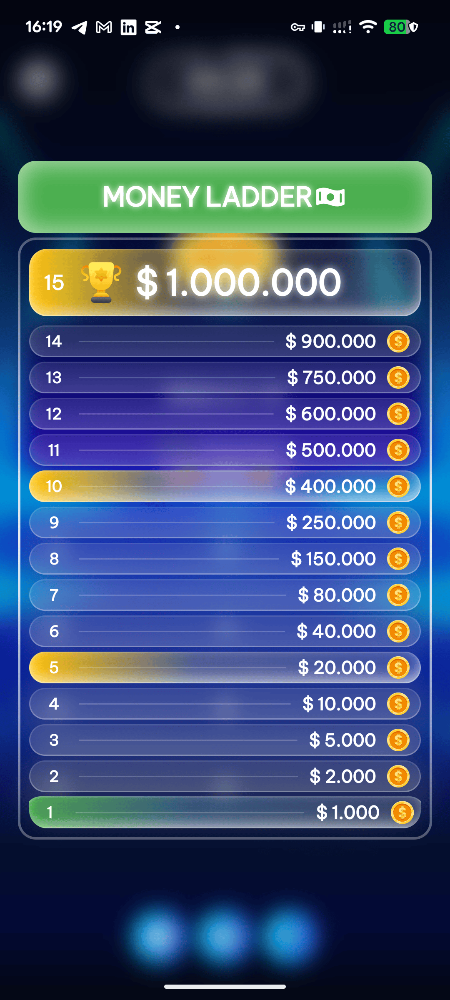
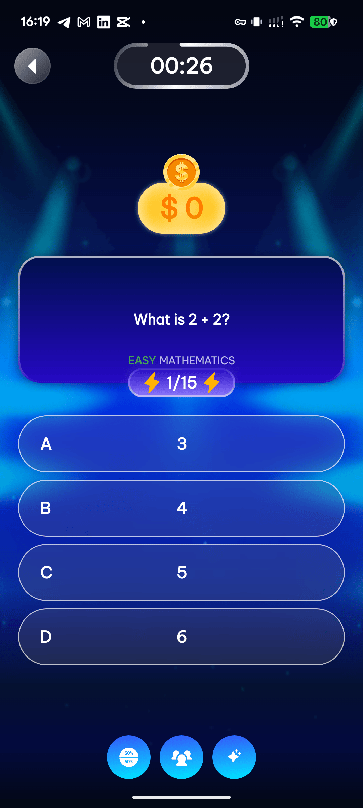
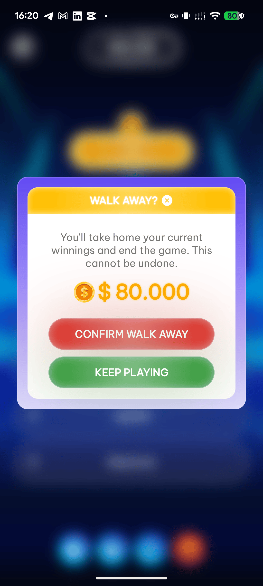
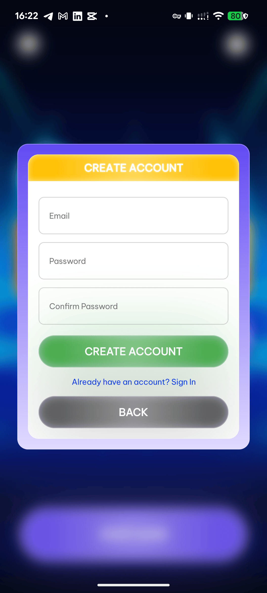
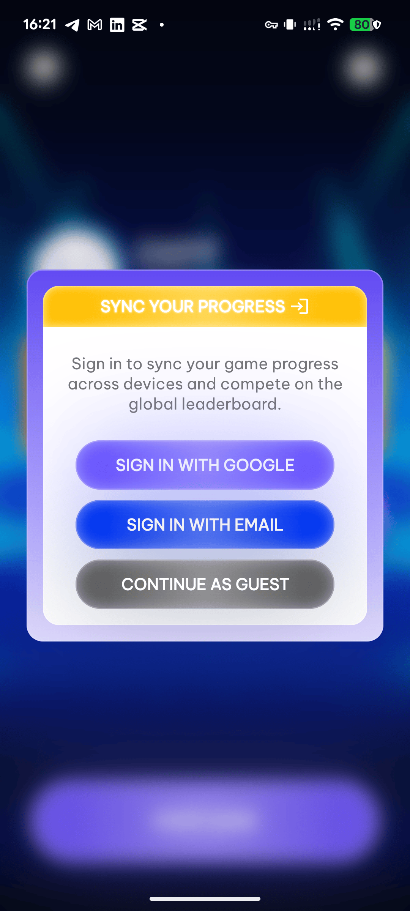
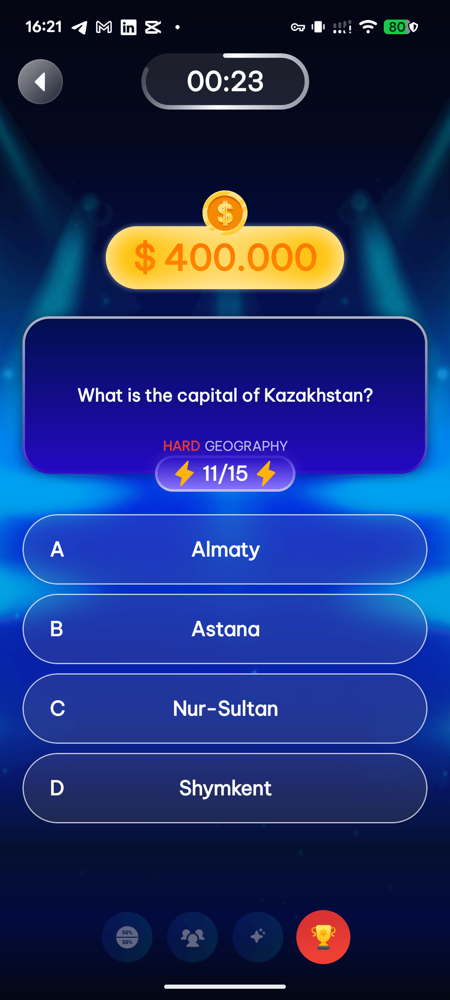

# Kotlin Accelerator

  

  <strong>Android learning app for the Kotlin Accelerator program by Dan Tech Academy.</strong>

  <a href="https://github.com/dan-tech-academy/kotlin-accelerator-public/releases/latest">Download APK</a>

## Overview

Kotlin Accelerator helps Android learners practice Kotlin, Jetpack Compose, and real mobile engineering patterns through short quiz sessions, progress tracking, and course-focused challenges.

This public repository contains only the product overview, screenshots, logo, and public APK releases. The application source code and private course infrastructure are not published here.

## Benefits

| Benefit | What learners get |
|---------|-------------------|
| Faster Kotlin recall | Practice core Kotlin and Android concepts with focused quiz rounds. |
| Real app context | Learn with screens and workflows inspired by production Android apps. |
| Progress feedback | Track scores, completion, and profile progress while practicing. |
| Course alignment | Content is designed to support the Kotlin Accelerator learning path. |
| Mobile-first habit | Practice directly on Android instead of only reading lessons or docs. |

## Screenshots

| | | |
|---|---|---|
|  |  |  |
|  |  |  |
|  |  |  |
|  |  | |

## Download

Latest public APK:

[Download Kotlin Accelerator APK](https://github.com/dan-tech-academy/kotlin-accelerator-public/releases/latest)

Current release asset:

`kotlin-accelerator-v1.0.0.apk`

## Installation

1. Open the latest release from this repository.
2. Download the APK asset.
3. Install it on Android 8.0 or newer.
4. If Android blocks the install, allow installation from your browser or file manager, then retry.

## About Dan Tech Academy

Dan Tech Academy creates practical software engineering learning products for developers who want to build real apps, not only follow tutorials.
